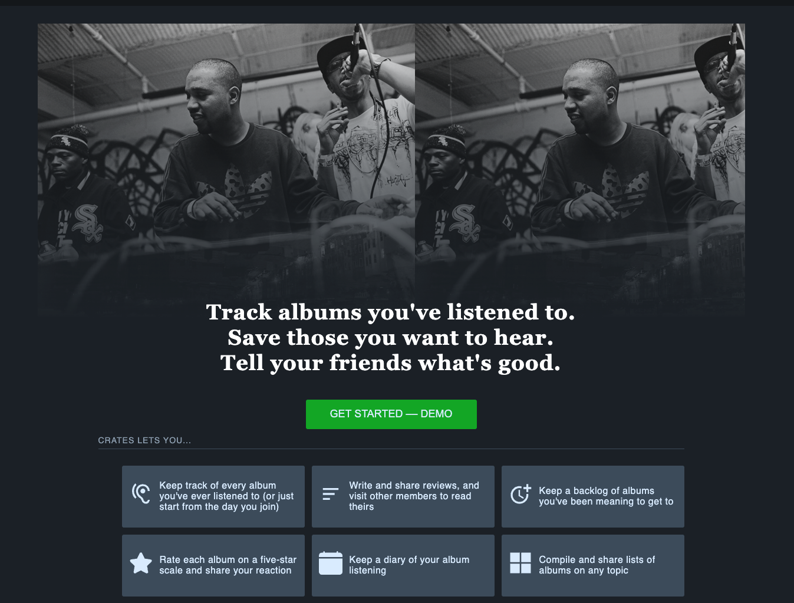

# Crates
[Crates](https://crates2022.herokuapp.com/), a clone of the film journaling network [Letterboxd](https://letterboxd.com/), is a platform for music listeners to keep a diary of what albums they have listened to. Users are able to write and share reviews, create lists of albums, and maintain a backlog.

Crates is a full-stack application with a frontend composed in React, a RESTful API and backend built on Express, and a relational database managed in PostgreSQL.

## Live Site
[Crates](https://crates2022.herokuapp.com/)

## Get Started
**Prerequisites**
- NPM
- A version of Node.js >= 14 on your machine
- PostgreSQL
- An App registered with [Spotify](https://developer.spotify.com/documentation/general/guides/authorization/app-settings/)

**Installation**
To run locally:
- Clone the repo: `git@github.com:minuminukim/crates.git`
- Navigate into `backend` and install dependencies with `npm install`
- Run `npm install` once again in `frontend`
- Set up a Postgres user with `CREATEDB` privileges and a password, then create a database
- In `backend` create a `.env` file and declare your environment variables. A `.env.example` file is provided as a reference
- This application requires a `Client ID` and `Client Secret` generated by registering an app on [Spotify](https://developer.spotify.com/documentation/general/guides/authorization/app-settings/) in order to receive the credentials to communicate with their API server.
- Initialize your database using sequelize-cli:
    -  `npx dotenv sequelize db:create`
    -  `npx dotenv sequelize db:migrate`
    -  `npx dotenv sequelize db:seed:all`
- Finally, start your servers by running `npm start` in `backend` and a second time in `frontend`

## Features
- User registration and JWT authentication
- Users are able to share, update and delete reviews of albums:

- Users can compile collections of albums in lists
- Users can maintain a backlog of albums to listen to

## Technologies
- React
- Redux
- Node.js
- Express
- PostgreSQL
- Sequelize
- Spotify Web API

