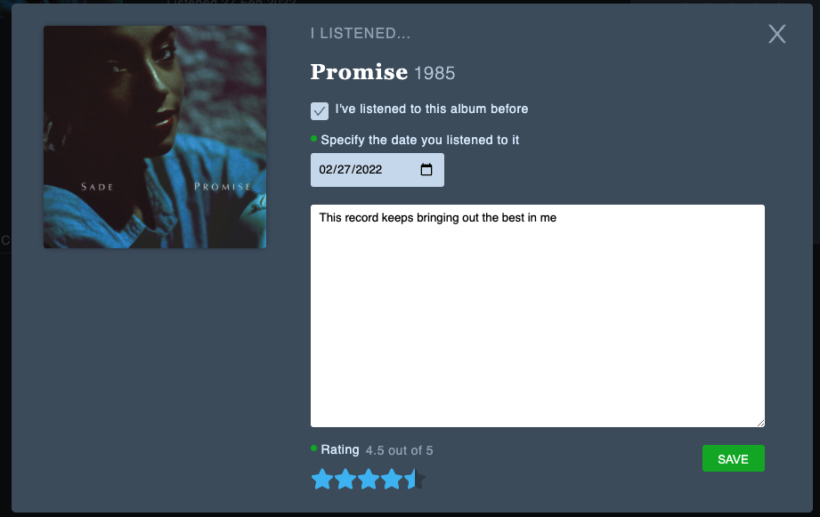

# Crates
[Crates](https://crates2022.herokuapp.com/), a clone of the film journaling network [Letterboxd](https://letterboxd.com/), is a platform for music listeners to keep a living diary of albums they have listened to.

A full-stack application, Crates is designed with a frontend composed in React, a RESTful API and server built in Express, and a relational database managed in PostgreSQL.

## Live Site
[Crates](https://crates2022.herokuapp.com/)

## Get Started
**Prerequisites**
- NPM
- A version of Node.js >= 14 on your machine
- PostgreSQL
- An App registered with [Spotify](https://developer.spotify.com/documentation/general/guides/authorization/app-settings/)

**Installation**
To run locally:
- Clone the repo: `git@github.com:minuminukim/crates.git`
- Navigate into `backend` and install dependencies with `npm install`
- Run `npm install` once again in `frontend`
- Set up a Postgres user with `CREATEDB` privileges and a password, then create a database
- In `backend` create a `.env` file and declare your environment variables. A `.env.example` file is provided as a reference
- This application requires a `Client ID` and `Client Secret` generated by registering an app on [Spotify](https://developer.spotify.com/documentation/general/guides/authorization/app-settings/) in order to receive the credentials to communicate with their API server.
- Initialize your database using sequelize-cli:
    -  `npx dotenv sequelize db:create`
    -  `npx dotenv sequelize db:migrate`
    -  `npx dotenv sequelize db:seed:all`
- Finally, start your servers by running `npm start` in `backend` and a second time in `frontend`

## Features
* User registration and JWT authentication
* Share, update and delete reviews of albums.

* A user maintains a diary of their listening history:

* Compile collections of albums in (un)ordered lists:

* Maintain a backlog of records to listen to or revisit:

* Post, update and delete comments

## Technologies
- React
- Redux
- Node.js
- Express
- PostgreSQL
- Sequelize
- Spotify Web API

## Looking Forward
Pulling together an MVP in two weeks, compromises had to be made in the interest of time. I decided to focus in on journaling as the core identity of the project. Letterboxd also serves as a great database -- this is an aspect of the platform I'd like to expand on in future iterations. The application is currently connected to the Spotify Web API, which is communicated with through search requests as users generate content. However, it would be nice to be able to dynamically generate views for albums around the data that return from queries.

I'd like to overhaul the design of the Redux store. I believe that it was too closely modeled after the relational structure of the SQL database, which quickly became unwieldy and difficult to maintain. It would be nice to scale back its shape and flatten the data.

Additionally, I'd like to build a more responsive application that better serves the mobile experience.
